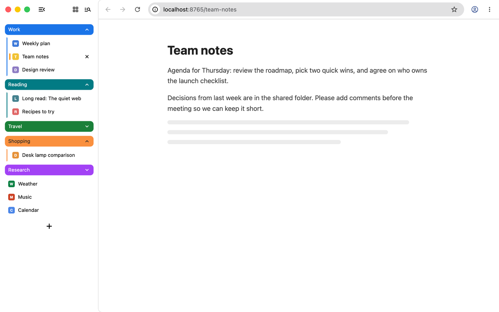
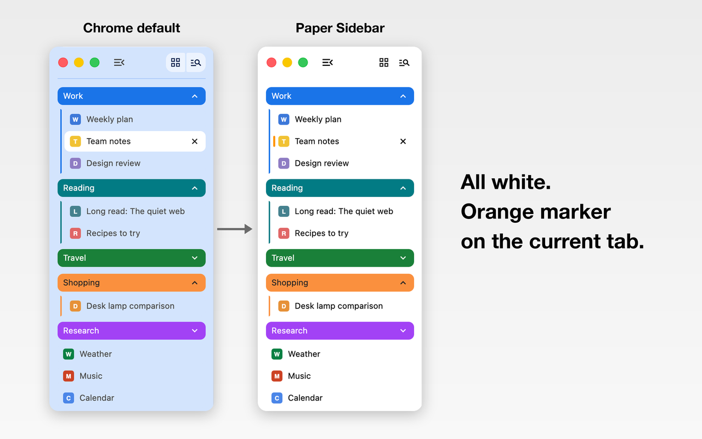

# 紙白側欄（Paper Sidebar）

[English](README.md) · **繁體中文**

這是一個專為 Chrome 原生**垂直分頁**設計的純配色主題。整個視窗維持白色，只在目前分頁的圖示旁邊加一條小小的橘色標記。

[](https://chromewebstore.google.com/detail/paper-sidebar/fbomcfigjianejcinmaloifgaladakic)





## 特色

- 分頁側欄、工具列、視窗外框全白，不會出現一整片灰色或帶色調的區塊。
- 目前分頁用一條橘色（#FF9500）膠囊標記，高度跟分頁圖示一樣。
- 分頁標題是黑色，其他分頁保持平整。
- 分頁群組保留 Chrome 原本的群組顏色。
- macOS 淺色、深色模式下外觀都一樣。
- 沒有程式碼、不需要任何權限、不收集任何資料。

## 安裝

- **Chrome 線上應用程式商店**：[紙白側欄](https://chromewebstore.google.com/detail/paper-sidebar/fbomcfigjianejcinmaloifgaladakic)。從商店安裝的主題，會在開啟「主題」同步後帶到你的其他電腦。
- **從原始碼安裝**：執行 `python3 tools/build.py`，再到 `chrome://extensions` 開啟「開發人員模式」→「**載入未封裝項目**」→ 選 `build/` 資料夾。這種方式裝的主題不會同步。

開啟垂直分頁：在任一分頁上按右鍵 →「**垂直顯示分頁**」。
移除主題：設定 → 外觀 → 主題 →「**重設為預設值**」。

## 原理

Chrome 主題不能用 CSS 改介面，只能提供顏色和圖片。這個主題是依照 Chrome 的兩個行為設計的：

1. **作用中分頁一定使用 `toolbar` 顏色。** 同一個顏色也會畫在工具列、提示列和網頁外框上。如果把作用中分頁設成灰色，工具列和外框也會跟著變灰。所以這裡把 `toolbar` 設成白色，作用中分頁也就是白的。
2. **標記是一張圖片。** Chrome 會在兩個地方畫 `theme_toolbar` 圖片：
   - 在分頁上：從分頁自己的左上角開始畫，1 個圖片像素對應 1 個裝置像素。
   - 在工具列上：從視窗左緣開始畫。

   所以放在圖片左上角的小膠囊會出現在作用中分頁上，而在工具列那邊，這一塊剛好被側欄擋住。

顏色和標記的大小、位置都寫在 [`palette.json`](palette.json)。標記座標的單位是 2 倍（Retina）螢幕的裝置像素：分頁高 60px，圖示在 y 14–45。

## 限制

- 滑鼠移到某個分頁上時，那個分頁也會暫時出現標記，因為 Chrome 的 hover 效果會畫同一張圖。
- 標記是照 Retina 螢幕調的尺寸，在 1 倍螢幕上看起來大約會大一倍。
- 標記依賴 Chrome 目前畫主題圖片的方式，Chrome 以後改變做法時，位置可能會跑掉。
- 分頁群組顏色、字型、列高、側欄邊線都是 Chrome 自己畫的，主題改不到。
- 無痕視窗不會套用主題；在「自訂 Chrome」裡選顏色會取代這個主題。

## 開發

需要 Python 3（含 Pillow）；視覺測試另外需要 Node.js 22 以上。

```bash
python3 tools/build.py            # 驗證 palette.json、印出衍生色、產生 build/
python3 tools/build.py --zip      # 另外打包 dist/paper-sidebar-<版本>.zip（只收白名單檔案）
python3 tools/art.py store        # 商店 icon 與 440×280 宣傳圖
python3 tools/shots.py check      # 檢查商店素材尺寸
```

視覺測試會另外開一個用完即丟的 Chrome profile，完全不碰你自己的 profile。因為 headless 模式沒有分頁列可以看，測試視窗是有畫面的。測試腳本的做法：
- 用 DevTools Protocol 控制那個 Chrome：用 `Extensions.loadUnpacked` 載入主題，再用一個小型輔助擴充功能建立分頁群組；
- 用 `screencapture` 擷取視窗，這需要 macOS 的「螢幕錄製」權限。

```bash
export VT_UDD=/tmp/vt-udd                       # 暫用的 profile 資料夾
harness/run.sh                                  # 開啟測試用 Chrome
node harness/cdp.mjs load build                 # 安裝主題
node harness/cdp.mjs layout harness/layouts/store.json   # （store.json 需先執行：python3 harness/site.py harness/layouts/store.json）
node harness/cdp.mjs shot shots/test.png --when-front
python3 tools/shots.py sample shots/test.png 24,1155,438,1459   # 統計某區塊的 sRGB 顏色
harness/stop.sh --wipe
```

| 路徑 | 內容 |
|---|---|
| `palette.json` | 唯一的設定來源：名稱、版本、顏色、標記 |
| `tools/build.py` | 產生並驗證主題、打包 zip |
| `tools/art.py` | 圖示、宣傳圖、標記圖片 |
| `tools/shots.py` | 截圖取色、輸出商店尺寸 |
| `harness/` | 隔離 Chrome 測試工具（CDP、輔助擴充功能、版面設定） |
| `store/` | 商店說明文字與圖片 |
| `PUBLISH.md` | 上架／更新的逐步清單 |

## 授權

[MIT](LICENSE)
